# Documentazione - Feature Extractor

## 1. Introduzione
Lo scopo è quello di documentare i vari tentativi di addestramento per il blocco usato come feature extractor nel classificatore finale, per determinare quale configurazione iniziale possa garantire (almeno in questa fase) il risultato migliore.
L'idea alla base è quella di addestrare una rete per effettuare _Feature Exctraction_ a partire dalle immagini del dataset scelto. Data la natura dei dati l'operazione, verrà valutata la capacità del modello di riconoscere le classi d'interesse analizzando l'intera immagini.
Il modello che verrà reputato migliore verrà poi utilizzato per estrarre le _feature maps_ ed effettuare una fusione multimediale con la parte testuale dell'input del modello finale.
Il focus di questo documento è tuttavia il processo di addestramento per l'estrattore delle feature.

---

## 2. Configurazione dell'Addestramento
### 2.1 Dati Utilizzati
- **Origine dei dati:** dataset KvasirVQA, scaricabile da [questo link](https://datasets.simula.no/kvasir-vqa/)

- **Tipologia dei dati:** Immagini annotate relative al tratto gastro intestinale, con occasionale presenza di informazioni aggiuntive riguardanti la posizione delle feature nell'immagine (polipi e strumenti);
- **Dimensione del dataset:** Il peso totale delle 6.500 immagini presenti è di circa 335MB. per quanto riguarda invece il file metadata.csv si attesta sui 5MB con 4 colonne per circa 60.000 righe;
- **Pre-elaborazione:** Il processo di _Data Augmentation_ è stato documentato nel file `notebooks\data_augmentation.ipynb`.

### 2.2 Architettura del Modello
- **Tipo di modello:** Sono stati utilizzati tre diversi modelli come base per l'addestramento:
  - ResNet (50, 101, 152);
  - ViTb16;
  - VGG16.
- **Librerie/framework utilizzati:** Il processo di addestramento è stato realizzato utilizzando PyTorch
- **Hyperparametri principali:**
  - **Batch size:** 32;
  - **Numero di epoche:** 200 (massimo);
  - **Learning rate:** 5e-4
  - **Ottimizzatore:** SGD
  - **Funzione di perdita:** Cross Entropy Loss 

### 2.3 Infrastruttura
- **Hardware utilizzato:** 
  - **CPU**: 12th Gen Intel(R) Core(TM) i7-12700KF
  - **GPU**: NVIDIA GeForce RTX 3060 Ti
  - **RAM**: 32GB DDR4
- **Ambiente software:** Vedi file `requirements.txt`

---

## 3. Risultati dell'Addestramento

A seguire, elenchiamo per ogni architettura la configurazione che ha prodotto il risultato migliore che verrà utilizzato per il modello finale.
La metrica utilizzata è il **Macro F1-score** calcola la media dell'F1-score su tutte le classi, trattandole equamente, indipendentemente dalla loro frequenza nel dataset.
Questa metrica è particolarmente indicata per valutare l'impatto della **data augmentation** sulle classi meno rappresentate, evitando che le classi maggioritarie influenzino eccessivamente il risultato, garantisce una valutazione bilanciata delle prestazioni del modello, riflettendo i miglioramenti nelle classi sottorappresentate.

### Formula
Macro F1 = (F1_class1 + F1_class2 + ... + F1_classN) / N

Dove:
- `N` è il numero totale di classi.
- `F1_classX` è l'F1-score calcolato per la classe `X`.

Questa scelta consente un'analisi più equa e dettagliata delle prestazioni del modello nei casi di dataset riequilibrati tramite data augmentation.

### 3.1 ResNet50

### 3.1.1 Data Augmentation - Freeze = 1

**Run ID**: 11122024151717

**Test Accuracy**: 78%

**Grafico dell'addestramento**:

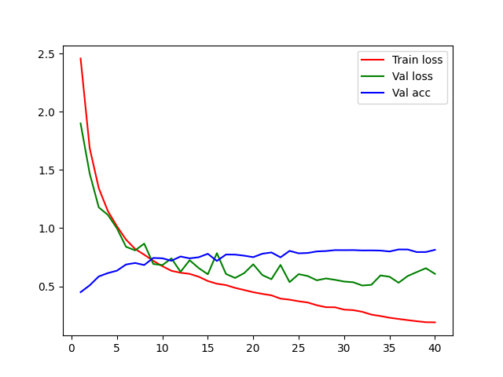

### 3.1.2 No Data Augmentation - Freeze = 1

**Run ID**: 11122024164345

**Test Accuracy**: 51%

**Grafico dell'addestramento**:

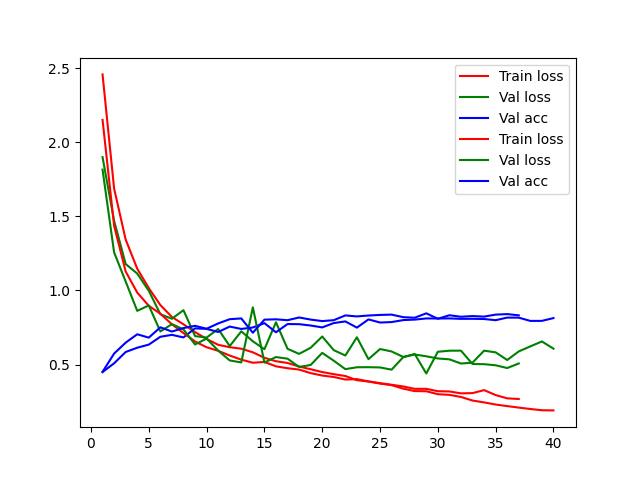

### 3.1.3 Data Augmentation - Freeze = 2

**Run ID**: 11122024174536

**Test Accuracy**: 75%

**Grafico dell'addestramento**:

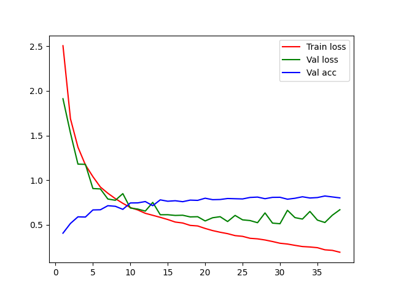

### 3.1.4 No Data Augmentation - Freeze = 2

**Run ID**: 11122024195525

**Test Accuracy**: 53%

**Grafico dell'addestramento**:

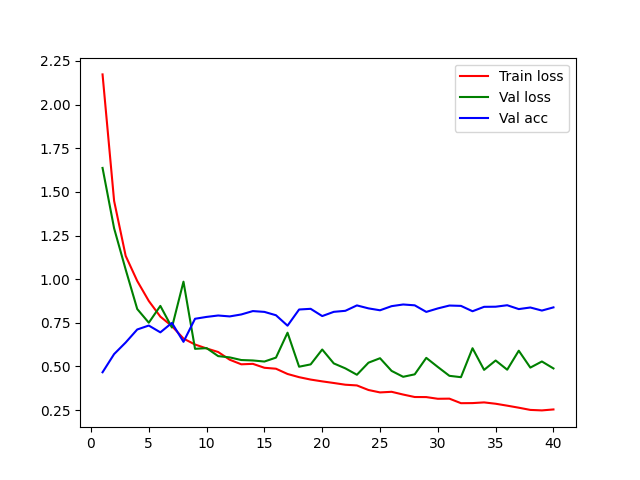

### 3.2 ResNet101

### 3.2.1 Data Augmentation - Freeze = 1

**Run ID**: 11122024211526

**Test Accuracy**: 78%

**Grafico dell'addestramento**:

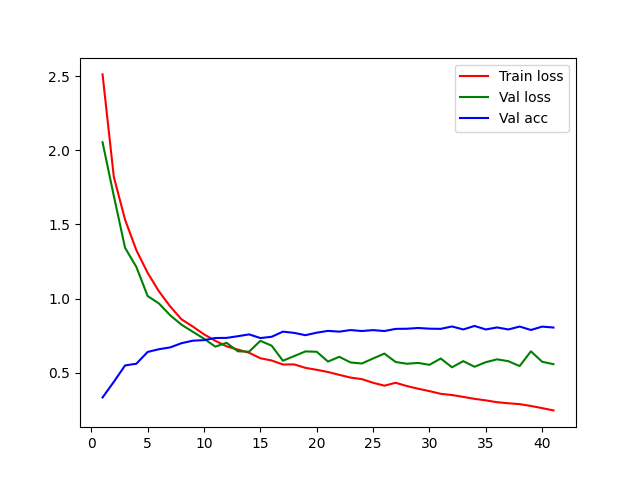

### 3.2.2 No Data Augmentation - Freeze = 1

**Run ID**: 11122024232001

**Test Accuracy**: 49%

**Grafico dell'addestramento**:

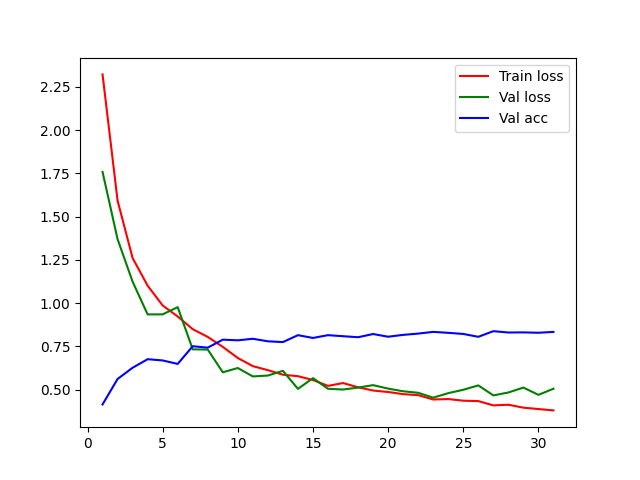

### 3.2.3 Data Augmentation - Freeze = 2

**Run ID**: 12122024002534

**Test Accuracy**: 74%

**Grafico dell'addestramento**:

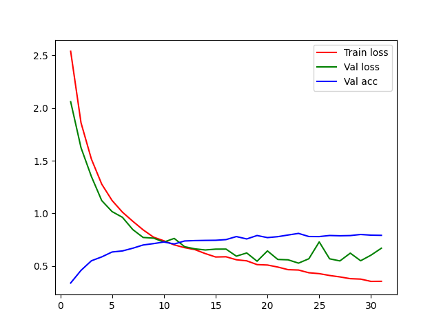

### 3.2.4 No Data Augmentation - Freeze = 2

**Run ID**: 12122024014841

**Test Accuracy**: 50%

**Grafico dell'addestramento**:

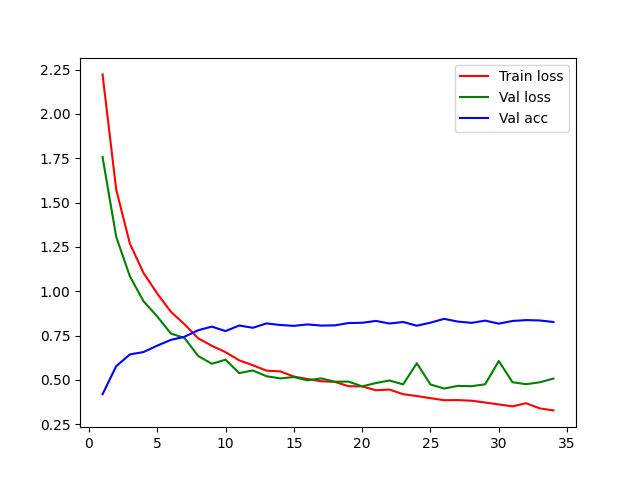

### 3.3 ResNet152

### 3.3.1 Data Augmentation - Freeze = 1

**Run ID**: 12122024030220

**Test Accuracy**: 75%

**Grafico dell'addestramento**:

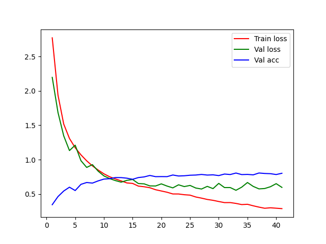

### 3.3.2 No Data Augmentation - Freeze = 1

**Run ID**: 12122024052027

**Test Accuracy**: 51%

**Grafico dell'addestramento**:

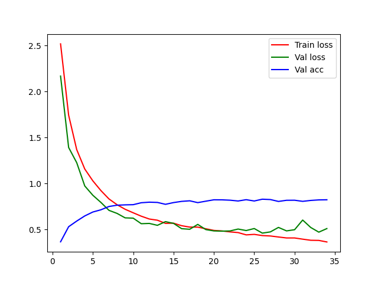

### 3.3.3 Data Augmentation - Freeze = 2

- **Run ID**: 12122024065037

- **Test Accuracy**: 75%

- **Grafico dell'addestramento**: 

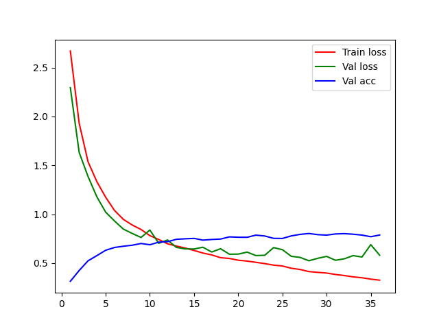

### 3.3.4 No Data Augmentation - Freeze = 2

**Run ID**: 12122024085028

**Test Accuracy**: 50%

**Grafico dell'addestramento**:

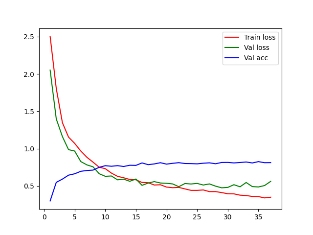

### 3.4 VGG16

### 3.4.1 Data Augmentation - Freeze = 1

**Run ID**: 12122024102819

**Test Accuracy**: 63%

**Grafico dell'addestramento**:

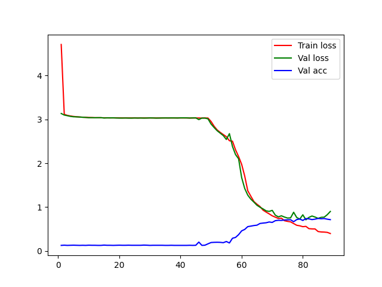

### 3.4.2 No Data Augmentation - Freeze = 1

**Run ID**: 12122024145542

**Test Accuracy**: 49%

**Grafico dell'addestramento**: 

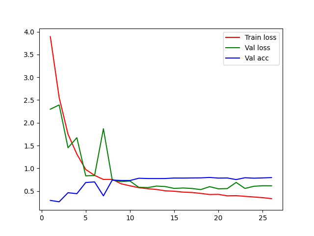

### 3.4.3 Data Augmentation - Freeze = 2

**Run ID**: 12122024155714

**Test Accuracy**: 70%

**Grafico dell'addestramento**:

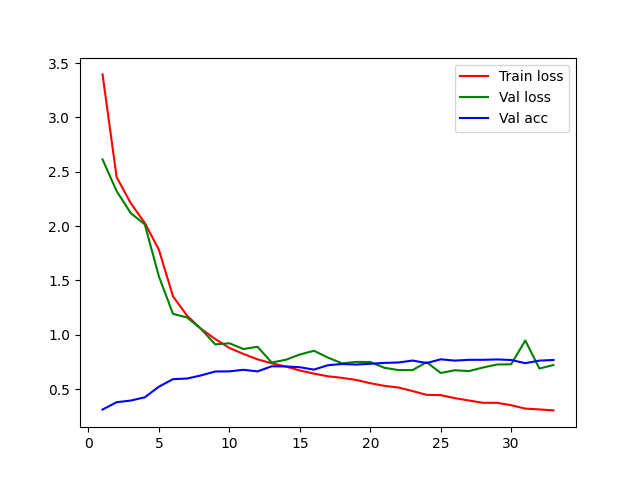

### 3.4.4 No Data Augmentation - Freeze = 2

**Run ID**: 12122024173630

**Test Accuracy**: 51%

**Grafico dell'addestramento**: 

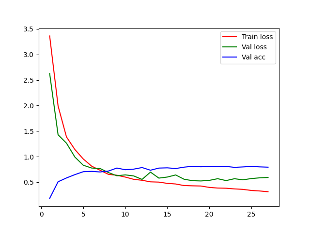

### 3.5 ViT B 16

### 3.5.1 Data Augmentation - Freeze = 1

**Run ID**: 12122024184040

**Test Accuracy**: 65%

**Grafico dell'addestramento**:

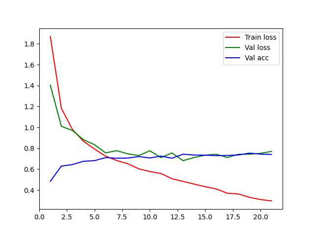

### 3.5.2 No Data Augmentation - Freeze = 1

**Run ID**: 12122024201323

**Test Accuracy**: 48%

**Grafico dell'addestramento**: 

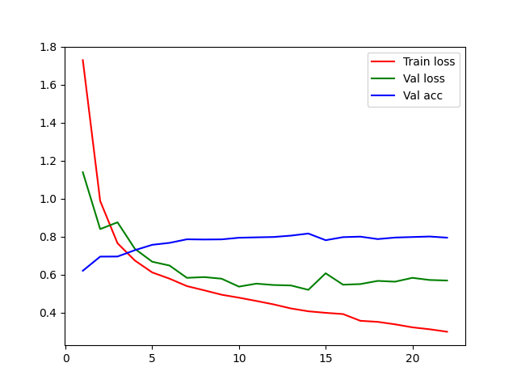

### 3.5.3 Data Augmentation - Freeze = 2

**Run ID**: 12122024212842

**Test Accuracy**: 67%

**Grafico dell'addestramento**:

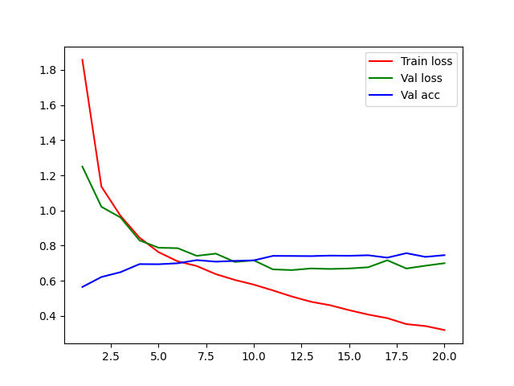

### 3.5.4 No Data Augmentation - Freeze = 2

**Run ID**: 13122024010744

**Test Accuracy**: 50%

**Grafico dell'addestramento**:

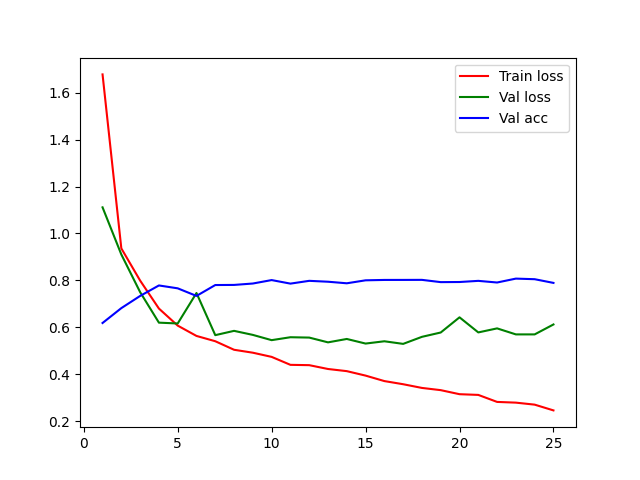

---

## 4. Lista configurazioni performanti

Ricordiamoci della legenda, per cui:
- Freeze = 1 -> solo la testa di classificazione è stata riaddestrata;
- Freeze = 2 -> è stato riaddestrato l'intero modello;
- Aug = 1 -> il dataset ha subito data augmentation;
- Aug = 0 -> il dataset NON ha subito data augmentation.

Verranno adesso elencate le configurazioni che hanno performato meglio per ogni architettura:
- ResNet50: 
  - Data Augmentation: 1
  - Freeze: 1 
  - Run ID: 11122024151717 
- ResNet101:
  - Data Augmentation: 1
  - Freeze: 1
  - Run ID: 11122024211526
- ResNet152:
  - Data Augmentation: 1
  - Freeze: 1
  - Run ID: 12122024030220
- VGG16:
  - Data Augmentation: 1
  - Freeze: 2
  - Run ID: 12122024155714
- ViTB16:
  - Data Augmentation: 1
  - Freeze: 2
  - Freeze: 12122024212842

## 5. Conclusioni e Prossimi Passi

Come possiamo vedere dagli esperimenti, generalmente un addestramento limitato alla testa di classificazione del modello sembra performare in maniera migliore rispetto a un riaddestramento totale della rete.
Inoltre, i modelli sembrano beneficiare delle operazioni di data augmentation operati sui dataset, data la presenza di classi estremamente poco rappresentate.

I passi successivi dello studio si concentreranno sul modello di VQA vero e proprio, che userà i risultati prodotti da questa analisi per la scelta del codificatore di immagini.