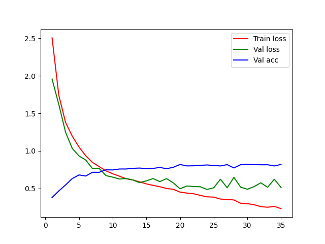
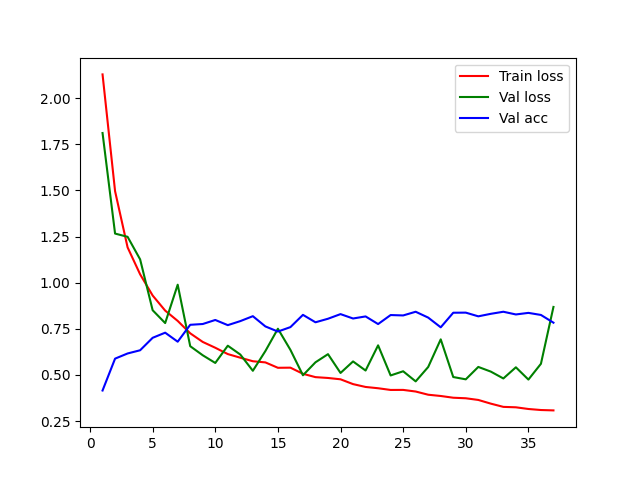
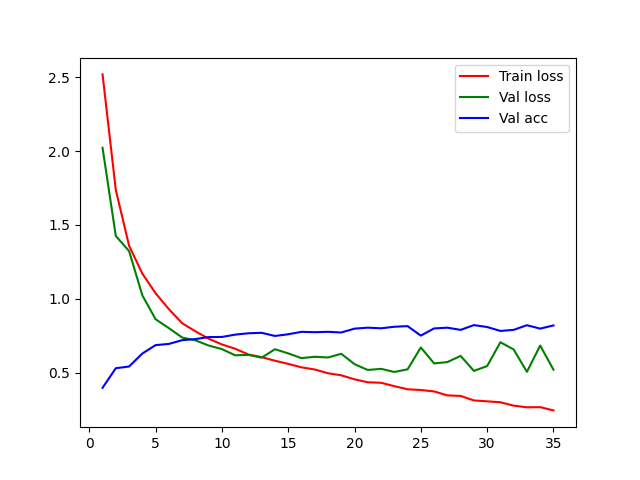
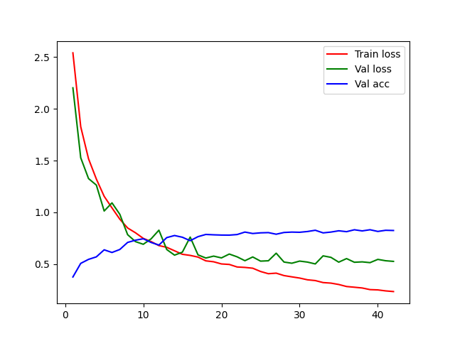
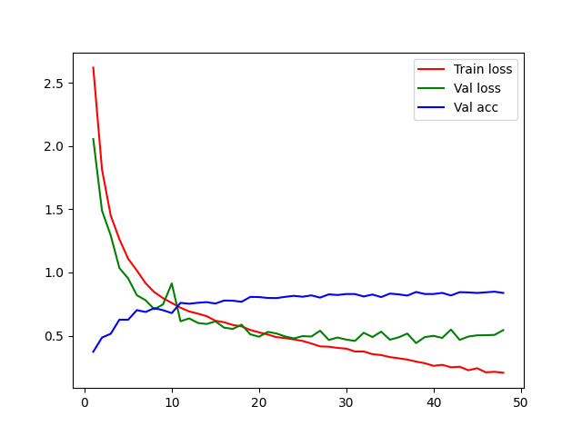
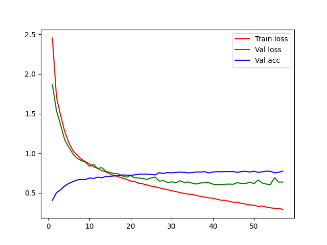

# Documentazione - Feature Extractor

## 1. Introduzione
Lo scopo è quello di documentare i vari tentativi di addestramento per il blocco usato come feature extractor nel classificatore finale, per determinare quale configurazione iniziale possa garantire (almeno in questa fase) il risultato migliore.
L'idea alla base è quella di addestrare una rete per effettuare _Feature Exctraction_ a partire dalle immagini del dataset scelto. Data la natura dei dati l'operazione, verrà valutata la capacità del modello di riconoscere le classi d'interesse analizzando l'intera immagini.
Il modello che verrà reputato migliore verrà poi utilizzato per estrarre le _feature maps_ ed effettuare una fusione multimediale con la parte testuale dell'input del modello finale.
Il focus di questo documento è tuttavia il processo di addestramento per l'estrattore delle feature.

---

## 2. Configurazione dell'Addestramento
### 2.1 Dati Utilizzati
- **Origine dei dati:** dataset KvasirVQA, scaricabile da [questo link](https://datasets.simula.no/kvasir-vqa/)

- **Tipologia dei dati:** Immagini annotate relative al tratto gastro intestinale, con occasionale presenza di informazioni aggiuntive riguardanti la posizione delle feature nell'immagine (polipi e strumenti);
- **Dimensione del dataset:** Il peso totale delle 6.500 immagini presenti è di circa 335MB. per quanto riguarda invece il file metadata.csv si attesta sui 5MB con 4 colonne per circa 60.000 righe;
- **Pre-elaborazione:** Il processo di _Data Augmentation_ è stato documentato nel file `notebooks\data_augmentation.ipynb`.

### 2.2 Architettura del Modello
- **Tipo di modello:** Sono stati utilizzati tre diversi modelli come base per l'addestramento:
  - ResNet (50, 101, 152);
  - ViTb16;
  - VGG16.
- **Librerie/framework utilizzati:** Il processo di addestramento è stato realizzato utilizzando PyTorch
- **Hyperparametri principali:**
  - **Batch size:** 32;
  - **Numero di epoche:** 100 (massimo);
  - **Learning rate:** 5e-4
  - **Ottimizzatore:** SGD
  - **Funzione di perdita:** Cross Entropy Loss 

### 2.3 Infrastruttura
- **Hardware utilizzato:** 
  - **CPU**: 12th Gen Intel(R) Core(TM) i7-12700KF
  - **GPU**: NVIDIA GeForce RTX 3060 Ti
  - **RAM**: 32GB DDR4
- **Ambiente software:** Vedi file `requirements.txt`

---

## 3. Risultati dell'Addestramento

A seguire sarà presente la sequenza di risultati e andamenti delle varie iterazioni di addestramento principali, ovvero quello che hanno mantenuto una combinazione di accuracy e loss migliori.
La metrica utilizzata è l'accuracy score, che rappresenta la frequenza con cui l'input corrisponde al target.
I risultati dell'addestramento saranno differenziati, indicando se tra i dati utilizzati sono presenti immagini che sono state generate tramite Data Augmentation e se è stato riaddestrato l'intero modello tra quelli utilizzati o soltanto l'ultimo layer.

### 3.1 ResNet50

### 3.1.1 Data Augmentation - Freeze = 1

**Run ID**: 30112024170627

**Best Accuracy**: 82%

**Validation Loss**: 0.5137511061083886

**Grafico dell'addestramento**:

### 3.1.2 No Data Augmentation - Freeze = 1

**Run ID**: 30112024194030

**Best Accuracy**: 84%

**Validation Loss**: 0.8684678720867532

**Grafico dell'addestramento**:

### 3.1.3 Data Augmentation - Freeze = 2

**Run ID**: 30112024220735

**Best Accuracy**: 82%

**Validation Loss**: 0.5196142233667835

**Grafico dell'addestramento**:

### 3.1.4 No Data Augmentation - Freeze = 2

**Run ID**:

**Best Accuracy**:

**Validation Loss**:

**Grafico dell'addestramento**:

### 3.2 ResNet101

### 3.2.1 Data Augmentation - Freeze = 1

**Run ID**: 30112024144542

**Best Accuracy**: 83%

**Validation Loss**: 0.525684341980565

**Grafico dell'addestramento**:

### 3.2.2 No Data Augmentation - Freeze = 1

**Run ID**:

**Best Accuracy**:

**Validation Loss**:

**Grafico dell'addestramento**:

### 3.2.3 Data Augmentation - Freeze = 2

**Run ID**:

**Best Accuracy**:

**Validation Loss**:

**Grafico dell'addestramento**:

### 3.2.4 No Data Augmentation - Freeze = 2

**Run ID**:

**Best Accuracy**:

**Validation Loss**:

**Grafico dell'addestramento**:

### 3.3 ResNet152

### 3.3.1 Data Augmentation - Freeze = 1

**Run ID**:

**Best Accuracy**:

**Validation Loss**:

**Grafico dell'addestramento**:

### 3.3.2 No Data Augmentation - Freeze = 1

**Run ID**:

**Best Accuracy**:

**Validation Loss**:

**Grafico dell'addestramento**:

### 3.3.3 Data Augmentation - Freeze = 2

- **Run ID**: 05112024120001

- **Best Accuracy**: 85%

- **Validation Loss**: 0.5441330722891368

- **Grafico dell'addestramento**: 

### 3.3.4 No Data Augmentation - Freeze = 2

**Run ID**:

**Best Accuracy**:

**Validation Loss**:

**Grafico dell'addestramento**:

### 3.4 VGG16

### 3.4.1 Data Augmentation - Freeze = 1

**Run ID**:

**Best Accuracy**:

**Validation Loss**:

**Grafico dell'addestramento**:

### 3.4.2 No Data Augmentation - Freeze = 1

**Run ID**:

**Best Accuracy**:

**Validation Loss**:

**Grafico dell'addestramento**:

### 3.4.3 Data Augmentation - Freeze = 2

**Run ID**:

**Best Accuracy**:

**Validation Loss**:

**Grafico dell'addestramento**:

### 3.4.4 No Data Augmentation - Freeze = 2

**Run ID**:

**Best Accuracy**:

**Validation Loss**:

**Grafico dell'addestramento**:

### 3.5 ViT B 16

### 3.5.1 Data Augmentation - Freeze = 1

**Run ID**:

**Best Accuracy**:

**Validation Loss**:

**Grafico dell'addestramento**:

### 3.5.2 No Data Augmentation - Freeze = 1

**Run ID**:

**Best Accuracy**:

**Validation Loss**:

**Grafico dell'addestramento**:

### 3.5.3 Data Augmentation - Freeze = 2

**Run ID**: 08112024021141

**Best Accuracy**: 77%

**Validation Loss**: 0.6361981792232165

**Grafico dell'addestramento**:

### 3.5.4 No Data Augmentation - Freeze = 2

**Run ID**:

**Best Accuracy**:

**Validation Loss**:

**Grafico dell'addestramento**:

---
   
## 4. Problemi e Limitazioni
Descrivere eventuali difficoltà incontrate durante l’addestramento, colli di bottiglia, o limitazioni del modello.

---

## 5. Conclusioni e Prossimi Passi
- **Riepilogo dei risultati principali:**
- **Proposte per miglioramenti futuri:** 
  - Ottimizzazione dei dati
  - Cambiamenti nell'architettura del modello
  - Utilizzo di nuove tecniche di addestramento

---

## 7. Riferimenti
Elencare fonti o risorse utilizzate, incluse librerie, articoli scientifici, e dataset.

---

## 8. Allegati
Includere eventuali immagini, grafici, o file di log utili per integrare la documentazione.
